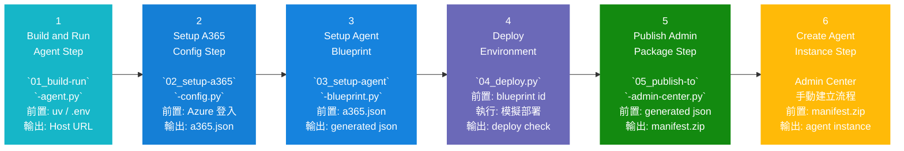

# publishAgent 使用說明

這個資料夾提供一套由 01 到 05 的 Python 腳本，協助你用較容易理解的方式完成 Agent 365 的本機測試、設定、藍圖建立與 manifest 封裝。

這份文件的目標是：

- 用最少的步驟理解整體流程
- 知道每支腳本負責什麼工作
- 依照順序執行，減少出錯機會

## 專案結構

```text
publishAgent/
├── _common.py
├── 01_build-run-agent.py
├── 02_setup-a365-config.py
├── 03_setup-agent-blueprint.py
├── 04_deploy.py
├── 05_publish-to-admin-center.py
└── README.md
```

## 建議使用順序

建議依照下面順序執行：

1. `01_build-run-agent.py`
2. `02_setup-a365-config.py`
3. `03_setup-agent-blueprint.py`
4. `04_deploy.py`
5. `05_publish-to-admin-center.py`

如果你只想重新產生新版 `manifest.zip`，通常只需要直接執行第 5 步。

## Mermaid 步驟圖

下面這張 Mermaid 圖對應附件中的 6 步驟流程，並且把第 1 到第 5 步直接對應到 `publishAgent` 內的 Python 腳本：



補充說明：

- 第 1 到第 5 步是這個資料夾中的腳本流程
- 第 6 步不是 Python 腳本，而是在 Agent 365 Admin Center 內完成的手動操作
- Mermaid 圖中的 `前置` 代表執行該步驟前通常要先備妥的條件
- Mermaid 圖中的 `輸出` 代表該步驟完成後最重要的產物或結果

## 執行前準備

開始前，請先確認：

1. 已安裝 `uv`
2. 已登入 Azure CLI
3. 專案根目錄的 `.env` 已填好必要設定
4. 專案根目錄已有 `a365.config.json`，或準備在第 2 步建立它

常用指令：

```bash
az login
uv run python publishAgent/02_setup-a365-config.py
```

## 每個檔案的簡易說明

### `_common.py`

這是共用工具檔，不需要單獨執行。

主要功能：

- 取得路徑
- 載入 `.env`
- 讀寫 JSON
- 執行命令
- 輸出統一格式的訊息
- 做基本驗證

你可以把它理解成：其他 01 到 05 腳本都會共用的工具箱。

### `01_build-run-agent.py`

用途：

- 啟動本機 Agent Host
- 視需要啟動 Microsoft 365 Agents Playground
- 幫你確認本機端點是否正常

適合什麼時候用：

- 想先確認 agent 本機能不能跑起來
- 想在發佈前先做本機測試

基本用法：

```bash
uv run python publishAgent/01_build-run-agent.py
```

只啟動 agent、不啟動 Playground：

```bash
uv run python publishAgent/01_build-run-agent.py --skip-playground
```

你會看到的結果：

- 本機 agent 啟動
- 顯示健康檢查網址
- 如果有開 Playground，也會顯示 UI 網址

### `02_setup-a365-config.py`

用途：

- 建立或更新 `a365.config.json`
- 把 Agent 365 後續步驟需要的設定整理好

適合什麼時候用：

- 第一次設定專案
- Azure 資源名稱、租戶、訂閱、endpoint 變更時

基本用法：

```bash
uv run python publishAgent/02_setup-a365-config.py
```

你會需要準備的資訊通常包含：

- Tenant ID
- Subscription ID
- Azure location
- Resource group
- Web App 名稱
- Agent 顯示名稱
- Manager email
- Messaging endpoint

你可以把這一步理解成：先把後續流程要用的設定檔準備好。

### `03_setup-agent-blueprint.py`

用途：

- 呼叫 `a365` 與 `az` CLI，建立或接續使用 Agent Blueprint
- 產生 `a365.generated.config.json`
- 產生 `agent-blueprint.metadata.json`

適合什麼時候用：

- 第 2 步完成後
- 想讓後面的 publish 流程知道要綁定哪個 blueprint

基本用法：

```bash
uv run python publishAgent/03_setup-agent-blueprint.py
```

如果你只想看會跑什麼命令：

```bash
uv run python publishAgent/03_setup-agent-blueprint.py --dry-run
```

這一步成功後，通常會得到：

- `a365.generated.config.json`
- `agent-blueprint.metadata.json`
- 可用來封裝 manifest 的 blueprint 資訊

Blueprint 相關檔案：

- `a365.config.json`：第 3 步使用的輸入設定
- `a365.generated.config.json`：第 3 步執行後的最小必要輸出
- `agent-blueprint.metadata.json`：較完整的 blueprint metadata，方便稽核、交接與後續封裝
- `agent-blueprint.metadata.template.json`：嚴謹版 metadata 範本，可當作欄位設計基準

補充：

- 如果環境中已設定 `AGENT_BLUEPRINT_ID`，腳本會先嘗試直接重用既有 blueprint，成功時會跳過耗時的 `a365 setup requirements` 與 `a365 setup all`

### `agentBlueprintId` / `objectId` / `servicePrincipalObjectId` 的差異

這三個欄位都和 blueprint 身分有關，但代表的是不同層級的物件：

- `agentBlueprintId`
  - 這通常是 App Registration 的 `Application (client) ID`
  - 它最常拿來給外部系統引用，也是 manifest 綁定時最重要的 ID
  - 在這個 repo 裡，第 5 步會把它寫進 `webApplicationInfo.id`、`bots[0].botId` 與 custom engine agent id
- `agentBlueprintObjectId`
  - 這是 Entra ID 裡 Application 物件本身的 `Object ID`
  - 它代表「應用程式定義」這個目錄物件，偏向管理與查詢用途
  - 你在 Entra / Graph / Azure CLI 查 App Registration 詳細資料時，常會看到這個值
- `agentBlueprintServicePrincipalObjectId`
  - 這是 Service Principal 的 `Object ID`
  - 它代表這個應用在租戶內實際可被授權、指派權限、套用 consent 的企業應用實體
  - 如果要追查租戶內的授權、角色指派、企業應用設定，通常會看這個值

可以把它簡化理解成：

- `agentBlueprintId` = 對外引用最常用的 client id
- `agentBlueprintObjectId` = App Registration 定義本身的 object id
- `agentBlueprintServicePrincipalObjectId` = 租戶內企業應用實體的 object id

### Blueprint 欄位對照表

| 來源檔案 | 欄位名稱 | 用途 | 是否必要 |
| --- | --- | --- | --- |
| `a365.config.json` | `tenantId` | 指定 Agent 所屬租戶 | 必要 |
| `a365.config.json` | `subscriptionId` | 指定 Azure 訂閱 | 必要 |
| `a365.config.json` | `resourceGroup` | 指定部署資源群組 | 必要 |
| `a365.config.json` | `location` | 指定 Azure 區域 | 必要 |
| `a365.config.json` | `clientAppId` | 提供 client app 身分來源 | 建議 |
| `a365.config.json` | `agentBlueprintDisplayName` | 顯示 blueprint 名稱 | 建議 |
| `a365.config.json` | `webAppName` | 對應 agent Web App | 建議 |
| `a365.config.json` | `botMessagingEndpoint` / `messagingEndpoint` | 提供 Bot 訊息端點 | 必要 |
| `a365.generated.config.json` | `agentBlueprintId` | blueprint 的 client ID，也是後續 manifest 綁定核心欄位 | 必要 |
| `a365.generated.config.json` | `agentBlueprintObjectId` | Entra app object ID | 必要 |
| `a365.generated.config.json` | `agentBlueprintServicePrincipalObjectId` | service principal object ID | 必要 |
| `a365.generated.config.json` | `agentBlueprintClientSecretProtected` | 說明是否已有受保護的機密 | 建議 |
| `a365.generated.config.json` | `resourceConsents` | 記錄需要的資源同意 | 建議 |
| `a365.generated.config.json` | `completed` | 標示 setup 是否完成 | 必要 |
| `agent-blueprint.metadata.json` | `schemaVersion` | metadata 結構版本 | 必要 |
| `agent-blueprint.metadata.json` | `validationStatus` | 驗證狀態摘要 | 必要 |
| `agent-blueprint.metadata.json` | `validationErrors` | 缺漏或警告訊息 | 必要 |
| `agent-blueprint.metadata.json` | `identity.*` | 集中描述 blueprint 識別資訊 | 必要 |
| `agent-blueprint.metadata.json` | `environment.*` | 集中描述 Azure 環境資訊 | 必要 |
| `agent-blueprint.metadata.json` | `runtime.*` | 集中描述 agent 執行端點與資源 | 必要 |
| `agent-blueprint.metadata.json` | `agentProfile.*` | 集中描述 agent 顯示資訊與管理者 | 建議 |
| `agent-blueprint.metadata.json` | `security.*` | 集中描述 consent 與 secret 保護資訊 | 建議 |
| `agent-blueprint.metadata.json` | `audit.*` | 記錄來源、建立時間與更新時間 | 必要 |

### `04_deploy.py`

用途：

- 模擬部署流程
- 讓教學步驟保持完整

適合什麼時候用：

- 想照完整 01 到 05 順序走一次
- 想保留教學節奏，但目前不真的部署 Azure 資源

基本用法：

```bash
uv run python publishAgent/04_deploy.py
```

注意：

- 這支腳本目前是示範用
- 它不會真的把程式部署到 Azure

### `05_publish-to-admin-center.py`

用途：

- 產生最新的 `manifest.json`
- 自動提升 manifest 版本號
- 自動產生新的 package/title ID
- 統一使用 `boy.png` 作為 icon
- 在 headless Linux 直接封裝 `manifest.zip`

適合什麼時候用：

- 想把最新 manifest 打包上傳到 Agent 365 Admin Center
- 前一次上傳後，想再產生新版 package

基本用法：

```bash
uv run python publishAgent/05_publish-to-admin-center.py
```

如果你只想先預覽，不真的寫檔：

```bash
uv run python publishAgent/05_publish-to-admin-center.py --dry-run
```

這一步會自動完成：

- 更新 `manifest/manifest.json`
- 更新 `manifest/agenticUserTemplateManifest.json`
- 同步讀取 `agent-blueprint.metadata.json` 補齊 blueprint 身分與執行端點資訊
- 在 `manifest/` 目錄輸出一份 `agent-blueprint.metadata.json` snapshot
- 更新 `manifest-template.json`
- 產生 `manifest/manifest.zip`

特別注意：

- 每次執行都會自動產生新的版本號
- 每次執行都會自動產生新的 package/title ID
- 如果根目錄存在 `agent-blueprint.metadata.json`，第 5 步會優先用它來對齊 blueprint id、resource 與 agent 顯示資訊
- 這是為了降低 Admin Center 出現舊版本或已部署 title 衝突的機率

## 最常用的完整流程

如果你是第一次執行，建議用下面順序：

```bash
uv run python publishAgent/01_build-run-agent.py
uv run python publishAgent/02_setup-a365-config.py
uv run python publishAgent/03_setup-agent-blueprint.py
uv run python publishAgent/04_deploy.py
uv run python publishAgent/05_publish-to-admin-center.py
```

如果你只是要重新產生新的上傳包，直接執行：

```bash
uv run python publishAgent/05_publish-to-admin-center.py
```

## 常見問題

### 1. 什麼時候只跑第 5 步就好？

當下面條件都已經成立時，通常只跑第 5 步即可：

- `a365.config.json` 已存在
- `a365.generated.config.json` 已存在
- 你只是想重新產生新版 `manifest.zip`

### 2. 如果 `03_setup-agent-blueprint.py` 失敗怎麼辦？

先檢查：

- 是否已 `az login`
- `.env` 與 `a365.config.json` 的值是否正確
- 是否已有可重用的 `AGENT_BLUEPRINT_ID`

### 3. 上傳到 Admin Center 時遇到版本或已部署錯誤怎麼辦？

先重新執行：

```bash
uv run python publishAgent/05_publish-to-admin-center.py
```

這支腳本已經會自動：

- 產生較新的版本號
- 產生新的 package/title ID

通常重新封裝後再上傳即可。

## 最後產物在哪裡

完成第 5 步後，最重要的檔案通常在專案根目錄下的 `manifest/`：

- `manifest/manifest.json`
- `manifest/agenticUserTemplateManifest.json`
- `manifest/manifest.zip`

其中真正要上傳到 Agent 365 Admin Center 的通常是：

- `manifest/manifest.zip`
